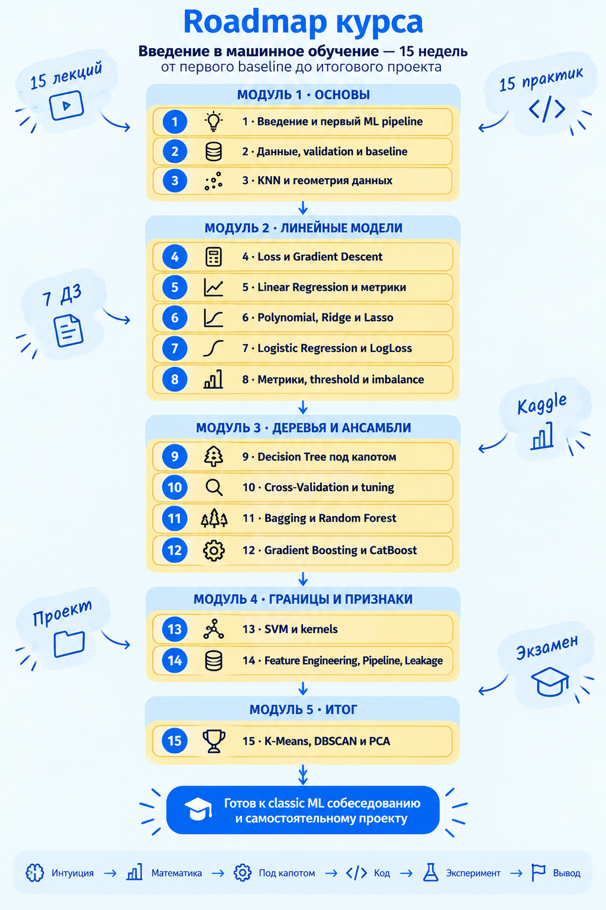

# Программа курса «Введение в машинное обучение»

Методический ориентир программы — [«Тренировки по ML 1.0» Яндекса](https://www.youtube.com/playlist?list=PLXtiZNKIobF5wGW0ExSn47db1I8uYnfIC), посвящённые классическому машинному обучению. Правила адаптации этого подхода зафиксированы в [методической системе курса](yandex_ml_training_methodology.md).

## 1. Цель курса

Сформировать фундаментальное понимание классического машинного обучения и научить студента решать базовые задачи анализа табличных данных: от постановки задачи и построения baseline до валидации, сравнения моделей и объяснения результата.

К концу курса студент должен уметь:

1. Определить объект, признаки и целевую переменную.
2. Отличать regression, classification и unsupervised learning.
3. Разделять данные на train, validation и test без утечки данных.
4. Выбирать baseline, loss и метрику под задачу.
5. Объяснять устройство KNN, линейных моделей, деревьев и ансамблей.
6. Обучать и сравнивать модели с помощью scikit-learn.
7. Использовать cross-validation, pipelines и подбор гиперпараметров.
8. Диагностировать overfitting, underfitting, imbalance и data leakage.
9. Проводить воспроизводимый ML-эксперимент и делать выводы.
10. Отвечать на основные вопросы секции Classical ML на собеседовании Junior Data Scientist / ML Intern.

## 2. Формат занятия

### Лекция

Каждая лекция строится по схеме:

`Problem → Intuition → Visual explanation → Math → Under the hood → Code → Experiment → Interview question → Summary`

На слайдах остаются только основные идеи, схемы, формулы и короткие фрагменты кода. Полные эксперименты выполняются в Jupyter Notebook.

### Практика

Практика строится по схеме:

1. Короткая постановка задачи.
2. Вопрос «что должно произойти?».
3. Совместный разбор примера.
4. Самостоятельная работа студентов.
5. Эксперимент с параметрами или данными.
6. Обсуждение результата и типичных ошибок.

## 3. Календарная программа на 15 недель

### Неделя 1. Введение в машинное обучение

#### Лекция

- Как устроен курс и система оценивания.
- Где используется классическое машинное обучение.
- Обычное программирование и обучение по данным.
- Объект, признак, target, dataset.
- Regression, classification, clustering.
- Training и inference.
- Общая карта ML-проекта.
- Parameter и hyperparameter.
- Почему `fit()` не является магией.
- Примеры вопросов с собеседований.

#### Практика

- Проверка Python, Jupyter и библиотек.
- Структура Jupyter Notebook.
- Загрузка небольшого датасета.
- Разделение признаков и target.
- Первый `train_test_split`.
- Обучение простой baseline-модели.
- Получение predictions и вычисление метрики.
- Сохранение аккуратного notebook с выводами.

**Результат недели:** студент видит полный ML pipeline, даже если пока не понимает все его блоки.

---

### Неделя 2. Данные, постановка задачи и корректный эксперимент

#### Лекция

- Dataset как матрица объектов и признаков.
- Типы признаков: числовые, категориальные, бинарные.
- Train, validation и test.
- Зачем нужен baseline.
- Loss и metric: в чём разница.
- Среднее, дисперсия, выбросы и распределение — в контексте ML.
- Основы exploratory data analysis.
- Первое знакомство с data leakage.
- Почему нельзя принимать решения по test set.

#### Практика

- EDA табличного датасета.
- Проверка типов, пропусков и распределений.
- Создание простого baseline.
- Сравнение dummy-модели и обучаемой модели.
- Демонстрация ошибочного эксперимента с leakage.
- Оформление таблицы результатов экспериментов.

**Результат недели:** студент умеет поставить базовый корректный эксперимент.

---

### Неделя 3. K-Nearest Neighbors и геометрия данных

#### Лекция

- Объект как точка в пространстве признаков.
- Евклидово и манхэттенское расстояния.
- KNN для classification и regression.
- Что происходит внутри `fit()` и `predict()`.
- Голосование и взвешенное голосование.
- Влияние числа соседей `k`.
- Почему scaling критически важен.
- Curse of dimensionality.
- Стоимость обучения, inference и хранения данных.

#### Практика

- Реализация KNN на NumPy.
- Вычисление расстояний и поиск ближайших объектов.
- Сравнение своей реализации со scikit-learn.
- Эксперимент с разными `k`.
- Эксперимент до и после масштабирования.
- Построение decision boundary на двумерных данных.

**Результат недели:** студент может пошагово объяснить предсказание KNN.

---

### Неделя 4. Функция потерь, производная и Gradient Descent

#### Лекция

- Зачем модели нужна функция потерь.
- Функция, производная, частная производная и градиент.
- Минимум функции и направление изменения.
- Формула Gradient Descent.
- Learning rate, iteration и convergence.
- Слишком маленький и слишком большой шаг.
- Batch, Stochastic и Mini-batch Gradient Descent.
- Связь оптимизации с обучением модели.

#### Практика

- Визуализация функции потерь.
- Численная и аналитическая производная.
- Реализация Gradient Descent для функции одной переменной.
- Переход к нескольким параметрам.
- Эксперименты с learning rate и начальной точкой.
- Графики loss curve.

**Результат недели:** студент понимает обучение как поиск параметров, уменьшающих loss.

---

### Неделя 5. Linear Regression и метрики регрессии

#### Лекция

- Линейная модель, веса и intercept.
- Prediction как взвешенная сумма признаков.
- Residuals.
- MSE и аналитическое решение задачи.
- Обучение линейной регрессии через Gradient Descent.
- MAE, MSE, RMSE и R².
- Чувствительность к выбросам.
- Основные предположения линейной регрессии.
- Интерпретация коэффициентов и её ограничения.

#### Практика

- Linear Regression from scratch через Gradient Descent.
- Сравнение со `LinearRegression`.
- Анализ loss curve.
- Ручной расчёт MAE, MSE, RMSE и R².
- Эксперимент с выбросами.
- Анализ коэффициентов модели.

**Результат недели:** студент связывает формулу модели, loss, оптимизацию и метрики.

---

### Неделя 6. Polynomial Regression и регуляризация

#### Лекция

- Нелинейная зависимость и преобразование признаков.
- Polynomial Features.
- Почему полиномиальная регрессия остаётся линейной моделью.
- Сложность модели, underfitting и overfitting.
- Ridge, Lasso и ElasticNet.
- Геометрическая и содержательная интуиция L1/L2.
- Влияние коэффициента регуляризации.
- Bias–variance trade-off на линейных моделях.

#### Практика

- Построение полиномиальных признаков.
- Сравнение степеней полинома.
- Визуализация underfitting и overfitting.
- Ridge и Lasso на признаках разного масштаба.
- Исследование зависимости качества и коэффициентов от `alpha`.
- Использование `Pipeline` для scaling и модели.

**Результат недели:** студент понимает связь сложности модели, регуляризации и обобщающей способности.

---

### Неделя 7. Logistic Regression и вероятностная классификация

#### Лекция

- Линейная комбинация признаков и sigmoid.
- Вероятность класса и decision boundary.
- Bernoulli distribution и идея Maximum Likelihood.
- Log-likelihood и LogLoss.
- Почему уверенная ошибка получает большой штраф.
- Что происходит внутри `fit()`, `predict_proba()` и `predict()`.
- Почему Logistic Regression называется регрессией.
- Роль регуляризации.

#### Практика

- Реализация sigmoid и LogLoss.
- Logistic Regression from scratch с Gradient Descent.
- Сравнение со scikit-learn.
- Визуализация вероятностей и decision boundary.
- Анализ влияния регуляризации.
- Проверка численной устойчивости вычислений.

**Результат недели:** студент понимает переход от линейного score к вероятности и классу.

---

### Неделя 8. Метрики классификации, threshold и imbalance

#### Лекция

- Confusion matrix: TP, TN, FP, FN.
- Accuracy, precision, recall и F1.
- Цена ошибок первого и второго рода.
- ROC curve и ROC-AUC.
- Precision–Recall curve и PR-AUC.
- Decision threshold и trade-off precision/recall.
- Почему threshold 0.5 не является универсальным.
- Imbalanced classification.
- Class weights, resampling и ограничения SMOTE.

#### Практика

- Расчёт метрик вручную и через sklearn.
- Построение confusion matrix, ROC и PR curves.
- Выбор threshold под прикладное условие.
- Сравнение accuracy и PR-AUC на несбалансированных данных.
- Использование `class_weight`.
- Обнаружение неправильного resampling до разделения данных.

**Результат недели:** студент выбирает метрику и порог исходя из смысла задачи.

---

### Неделя 9. Decision Tree под капотом

#### Лекция

- Узлы, ветви, листья и глубина дерева.
- Жадный алгоритм построения.
- Перебор признаков и thresholds.
- Gini, entropy и information gain.
- Критерий разбиения для regression.
- Ручной расчёт одного split.
- Ограничение сложности дерева.
- `max_depth`, `min_samples_split`, `min_samples_leaf`.
- Интерпретируемость и нестабильность дерева.

#### Практика

- Реализация поиска лучшего split на NumPy.
- Ручная проверка Gini/entropy.
- Обучение дерева классификации и регрессии.
- Визуализация структуры и decision boundary.
- Эксперимент с глубиной дерева.
- Переход underfitting → хорошая модель → overfitting.

**Результат недели:** студент может объяснить, как дерево выбирает очередное разбиение.

---

### Неделя 10. Validation, Cross-Validation и подбор гиперпараметров

#### Лекция

- Повторение train/validation/test на более глубоком уровне.
- Почему один split может вводить в заблуждение.
- K-Fold и Stratified K-Fold.
- Среднее качество и разброс результатов.
- Bias и variance.
- Learning curves и validation curves.
- Grid Search и Randomized Search.
- Nested selection и роль test set.
- Leakage во время preprocessing и model selection.

#### Практика

- Сравнение качества на разных случайных splits.
- Cross-validation нескольких моделей.
- `GridSearchCV` и `RandomizedSearchCV`.
- Анализ `cv_results_`.
- Построение validation curve.
- Правильное объединение preprocessing и модели в `Pipeline`.
- Старт первого этапа Kaggle.

**Результат недели:** студент умеет корректно сравнивать модели и настраивать гиперпараметры.

---

### Неделя 11. Bagging, Random Forest и Extra Trees

#### Лекция

- Нестабильность одиночного дерева.
- Bootstrap sampling.
- Bagging и усреднение моделей.
- Random Forest: bootstrap, случайные признаки и aggregation.
- Почему деревья ансамбля должны отличаться.
- Out-of-bag оценка.
- Feature importance и её ограничения.
- Extra Trees.
- Сравнение bias и variance дерева и леса.

#### Практика

- Самостоятельная реализация bootstrap sampling.
- Сравнение Tree, Bagging, Random Forest и Extra Trees.
- Анализ устойчивости на нескольких splits.
- Исследование `n_estimators`, `max_depth` и `max_features`.
- OOB score.
- Permutation importance вместо слепого доверия impurity importance.

**Результат недели:** студент понимает, почему ансамбль случайных деревьев устойчивее одного дерева.

---

### Неделя 12. Gradient Boosting и современные реализации

#### Лекция

- Bagging и boosting: фундаментальное различие.
- Последовательное исправление ошибок.
- Начальная константа и residuals.
- Gradient Boosting как аддитивная модель.
- Отрицательный градиент функции потерь.
- Learning rate, число деревьев и глубина.
- Переобучение boosting-моделей.
- Концептуальные различия XGBoost, LightGBM и CatBoost.
- Категориальные признаки и ordered statistics в CatBoost.

#### Практика

- Упрощённый Gradient Boosting Regressor шаг за шагом.
- Сравнение Random Forest и Gradient Boosting.
- Эксперимент `learning_rate × n_estimators`.
- Обучение CatBoost на смешанных признаках.
- Early stopping.
- Продолжение Kaggle с boosting-моделью.

**Результат недели:** студент объясняет boosting как последовательное улучшение текущей модели.

---

### Неделя 13. Support Vector Machine и kernels

#### Лекция

- Линейный классификатор и разделяющая гиперплоскость.
- Margin и support vectors.
- Maximum margin.
- Hard margin и soft margin.
- Hinge loss.
- Параметр `C`.
- Kernel trick как вычислительная идея.
- Linear, polynomial и RBF kernels.
- Параметр `gamma`.
- Scaling и вычислительные ограничения SVM.

#### Практика

- Визуализация margin и support vectors.
- Эксперимент с `C`.
- Нелинейные данные и RBF kernel.
- Эксперимент с `C` и `gamma`.
- Сравнение Logistic Regression, KNN и SVM.
- Демонстрация влияния scaling.

**Результат недели:** студент понимает margin, роль support vectors и идею kernel trick.

---

### Неделя 14. Feature Engineering, Pipeline, leakage и интерпретация

#### Лекция

- Числовые и категориальные признаки.
- Пропуски, scaling и encoding.
- `ColumnTransformer` и `Pipeline`.
- Feature engineering и предметная гипотеза.
- Feature selection: filter, wrapper и embedded methods.
- Основные виды data leakage.
- Ablation study.
- Коэффициенты, permutation importance и SHAP — возможности и ограничения.
- Почему интерпретация модели не равна причинности.

#### Практика

- Полный pipeline для смешанного датасета.
- Imputation, scaling и one-hot encoding.
- Leakage Challenge: поиск специально добавленных ошибок.
- Создание новых признаков и ablation study.
- Permutation importance.
- Базовый SHAP-анализ готовой модели.
- Финализация Kaggle-решения.

**Результат недели:** студент строит безопасный воспроизводимый pipeline и проверяет пользу новых признаков.

---

### Неделя 15. Unsupervised Learning и итоговая карта курса

#### Лекция

- Отличие supervised и unsupervised learning.
- K-Means: objective, assignment и update.
- Инициализация, число кластеров и ограничения K-Means.
- DBSCAN: плотность, шум, `eps` и `min_samples`.
- PCA: проекция и сохранение максимальной вариативности.
- Scaling перед clustering и PCA.
- Anomaly detection — обзорно.
- Итоговая карта: данные → модель → objective → optimization → validation → metric.
- Повторение ключевых вопросов собеседования.

#### Практика

- K-Means from scratch на NumPy.
- Выбор числа кластеров и silhouette score.
- Пример, где K-Means даёт плохой результат.
- Сравнение K-Means и DBSCAN.
- PCA для двумерной визуализации данных.
- Консультация и проверка итогового проекта.
- Пробное мини-собеседование по курсу.

**Результат недели:** студент понимает базовые задачи обучения без учителя и связывает темы курса в единую систему.

## 4. Сквозные элементы курса

### Interview Question

В конце каждой лекции разбирается один типичный вопрос собеседования. На практиках проводятся пять коротких индивидуальных или групповых мини-собеседований.

### Experimental Thinking

В каждом notebook студент должен зафиксировать:

1. Гипотезу.
2. Условия эксперимента.
3. Полученный результат.
4. Объяснение результата.
5. Ограничения вывода.

### Mathematics When Needed

Математика вводится непосредственно перед применением:

- расстояния и нормы — перед KNN;
- производные и градиенты — перед Gradient Descent;
- likelihood — вместе с Logistic Regression;
- Gini и entropy — вместе с Decision Tree;
- bootstrap — перед Random Forest;
- отрицательный градиент — при изучении Gradient Boosting.

## 5. Темы, намеренно оставленные за пределами основного курса

- Deep Learning;
- NLP и Computer Vision;
- временные ряды;
- рекомендательные системы;
- deployment, API, Docker и Kubernetes;
- полноценный MLOps;
- сложные математические доказательства.

Эти темы можно упоминать как направления дальнейшего обучения, но они не должны вытеснять фундамент классического ML.
